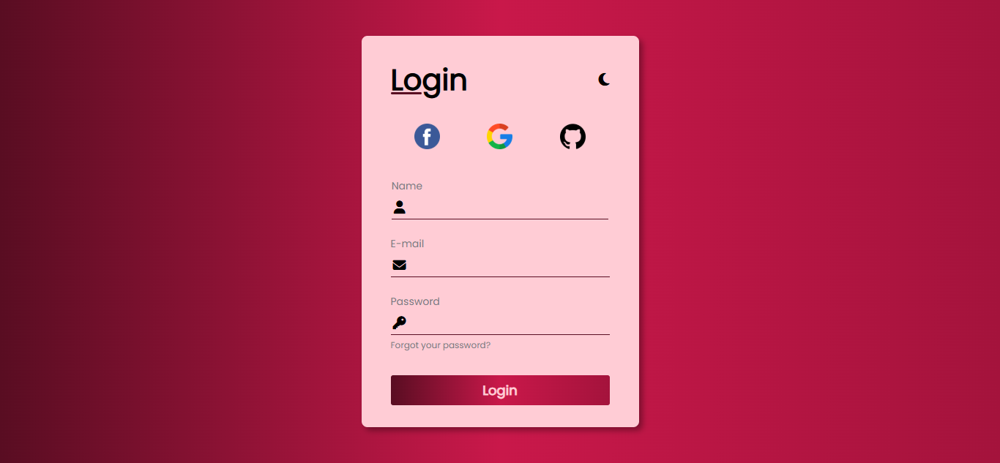

# 🌓 Formulário Responsivo com Modo Dark/Light

Formulário moderno, responsivo e estilizado com opção de alternância entre modo claro e escuro. Desenvolvido com HTML, CSS e JavaScript puro. O layout inclui campos de nome, e-mail, senha, redes sociais e transições suaves para uma ótima experiência do usuário.

---

## 🔗 Visualização

➡️ [Acesse o projeto online](https://samirasfonseca.github.io/Formul-rio-Modo-DARK-e-LIGHT/) 

---

## 🛠️ Tecnologias Utilizadas

| Tecnologia | Badge |
|------------|--------|
| **HTML5** |  |
| **CSS3** |  |
| **JavaScript** |  |
| **Font Awesome** |  |
| **Google Fonts** |  |

---

## 💡 Funcionalidades

- ✅ Layout responsivo
- ✅ Modo escuro/claro com botão de alternância
- ✅ Animações suaves
- ✅ Ícones de redes sociais
- ✅ Formulário com campos estilizados e acessíveis

---

